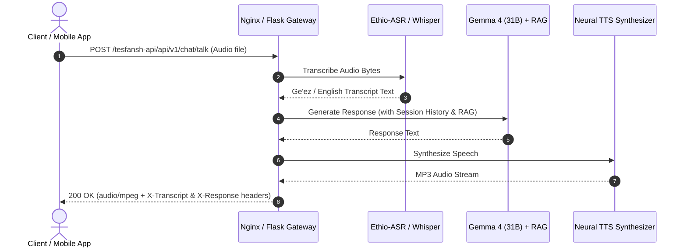

# 📡 Amani AI — Endpoints Reference

This package contains end-to-end composite API endpoints that chain speech recognition, neural inference, and voice synthesis into a single unified request/response pipeline.

---

## 🎙️ `talk.py` — Single-Shot Voice Conversation Endpoint

```http
POST /tesfansh-api/api/v1/chat/talk
Content-Type: multipart/form-data
```

The `/talk` endpoint provides a full voice-to-voice conversational loop in a single HTTP request:
1. **Speech-to-Text (STT):** Transcribes inbound audio using native Ge'ez `badrex/Ethio-ASR-amharic` (with `faster-whisper` fallback).
2. **Neural Inference (LLM):** Processes the prompt through the layer-sharded **Gemma 4 (31B)** model with session history & semantic RAG.
3. **Text-to-Speech (TTS):** Synthesizes the generated response into an **MP3 audio stream** (`audio/mpeg`).

---

### Request Parameters (Multipart Form)

| Field | Type | Required | Default | Description |
| :--- | :--- | :--- | :--- | :--- |
| `audio` | File (`binary`) | **Yes** | — | Audio file. WAV, WebM, MP4, OGG, or any standard audio format ($\ge 64$ bytes). |
| `session_id` | String | No | `default_session` | Unique session identifier for maintaining multi-turn conversational context. |
| `lang` | String | No | `auto` | Target language mode: `auto`, `am-ET` (Amharic), or `en-US` (English). |

---

### Response

* **Content-Type:** `audio/mpeg` (Binary MP3 stream)
* **Status Code:** `200 OK`

#### Response Custom Headers
The response includes metadata headers carrying intermediate text so clients can display transcripts and text responses without making a second API call:

| Header | Description |
| :--- | :--- |
| `X-Transcript` | The text transcribed from the user's speech input by the STT engine. |
| `X-Response` | The first 500 characters of the LLM's text reply. |
| `X-Detected-Language` | The language detected and used for speech synthesis (`am-ET` or `en-US`). |

---

### Error Responses

| Status Code | Reason | Example Response |
| :--- | :--- | :--- |
| `400 Bad Request` | Missing or empty `audio` field | `{"error": "Missing 'audio' field in form-data."}` |
| `422 Unprocessable` | Unintelligible audio (empty transcript) | `{"error": "Could not transcribe audio. Please speak clearly and try again."}` |
| `503 Service Unavailable` | Backend services still loading or model busy | `{"error": "Services not ready yet. Please wait and retry."}` |
| `500 Internal Error` | STT, LLM, or TTS failure | `{"error": "Speech recognition failed: ..."}` |

---

### Internal Execution Flow



---

### Usage Examples

#### 1. cURL
```bash
curl -X POST http://localhost:5000/tesfansh-api/api/v1/chat/talk \
  -F "audio=@my_recording.wav" \
  -F "session_id=user_001" \
  -F "lang=auto" \
  --output reply.mp3
```

#### 2. Python (`requests`)
```python
import requests

with open("my_recording.wav", "rb") as f:
    files = {"audio": ("recording.wav", f, "audio/wav")}
    data = {"session_id": "session_123", "lang": "auto"}
    
    response = requests.post(
        "http://localhost:5000/tesfansh-api/api/v1/chat/talk",
        files=files,
        data=data
    )

if response.status_code == 200:
    print("User said:", response.headers.get("X-Transcript"))
    print("Bot replied:", response.headers.get("X-Response"))
    with open("bot_speech.mp3", "wb") as out:
        out.write(response.content)
else:
    print("Error:", response.json())
```

#### 3. JavaScript (`fetch` / FormData)
```javascript
const formData = new FormData();
formData.append("audio", audioBlob, "recording.webm");
formData.append("session_id", "web_client_1");
formData.append("lang", "auto");

const response = await fetch("/tesfansh-api/api/v1/chat/talk", {
  method: "POST",
  body: formData
});

const transcript = response.headers.get("X-Transcript");
const responseText = response.headers.get("X-Response");
const audioBlob = await response.blob();
const audioUrl = URL.createObjectURL(audioBlob);
new Audio(audioUrl).play();
```
